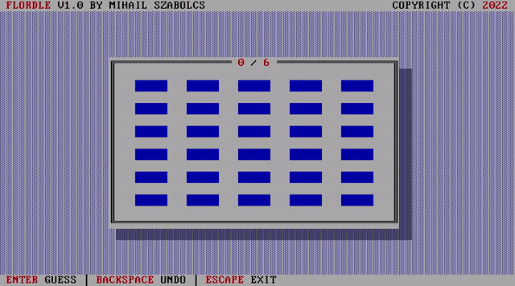

Flordle
=======
**Flordle** is a *boot-able* and *M$-DOS compatible* text-mode [Wordle][worldle] clone.

It has **1024** unique words built-in and fits in a paltry **8 kilo-bytes**.

Who can refuse **1024 days** of joy and fun?



Getting Started
---------------

If you want to try it out then the easiest and most convenient way is to click [here][play] and experience it straight within the confines of your very own browser.

Now, if you are feeling more adventurous and want to give it an honest try on real hardware, then you got a few options waiting for you down below.

### WARNING

I am not responsible for any direct or indirect data loss or any other damages after performing any of the destructive operations presented below. Consider yourself **WARNED!**

**BE SURE TO BACKUP THE CONTENTS OF YOUR MEDIUM OF CHOICE!**

### Boot from USB Memory Stick / Floppy Disk

In order to try it out on relatively modern hardware that can boot from USB (including USB with floppy disk emulation) write `build/FLORDLE.IMG` to a USB memory stick.

Alternatively, you can go the way the gods intended and use a Floppy Disk.

On Linux/macOS you can use the quintessential `dd` command from a terminal like so:

```bash
$ dd if=build/FLORDLE.IMG of=/dev/sdX
```

Where `/dev/sdX` is your USB memory stick / floppy disk. For example `/dev/sdc`.

On Windows, a utility like [Raw Write 32][rawwrite32] can be used to achieve pretty much the same result.

### Boot from CD

If the machine of your choice doesn't boot from USB, but it can boot from a CD with floppy disk emulation) then you can just burn `build/FLORDLE.ISO`.

On Linux you can use something like [Brasero][brasero].

On Windows the excellent [CDBurnerXP][cdburnerxp] will do the job just fine.

### M$-DOS / Windows

Just copy and run `build/FLORDLE.COM` on any machine running M$-DOS or Windows up to WinXP.

### Build from Source

* NASM (required)
* QEMU (optional, needed for testing)
* DOSBox (optional, needed for testing)

If you are one of those people who does not trust pre-compiled binaries and wishes to build things straight from source, well you are in luck, because it's terrible simple to do so and can be achieved by typing the following incantations in any terminal:

```bash
$ make
$ make iso
$ make com
```

In order to try out the boot-able version type in the following recipe:

```bash
$ make qemu
```

To try out the DOS version type in the following incantation:

```bash
$ make dosbox
```

Contribute
----------

* Fork the project.
* Make your feature addition or bug fix.
* Do **not** bump the version number.
* Create a pull request. Bonus points for topic branches.

License
-------
Copyright (c) 2022, Mihail Szabolcs

**Flordle** is provided **as-is** under the **MIT** license. For more information see LICENSE.

[wordle]: https://www.nytimes.com/games/wordle/index.html
[rawwrite32]: http://www.netbsd.org/~martin/rawrite32/
[brasero]: http://wiki.gnome.org/Apps/Brasero
[ cdburnerxp]: https://cdburnerxp.se/en/home
[play]: https://mihail.co/flordle
